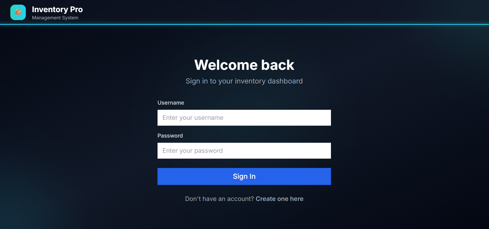
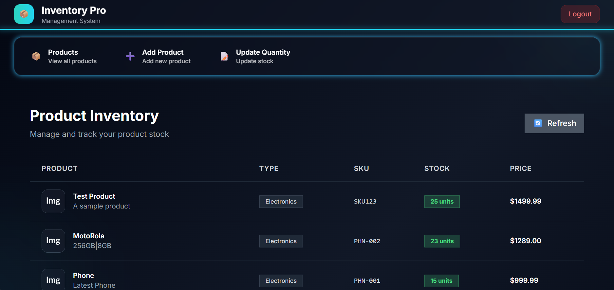
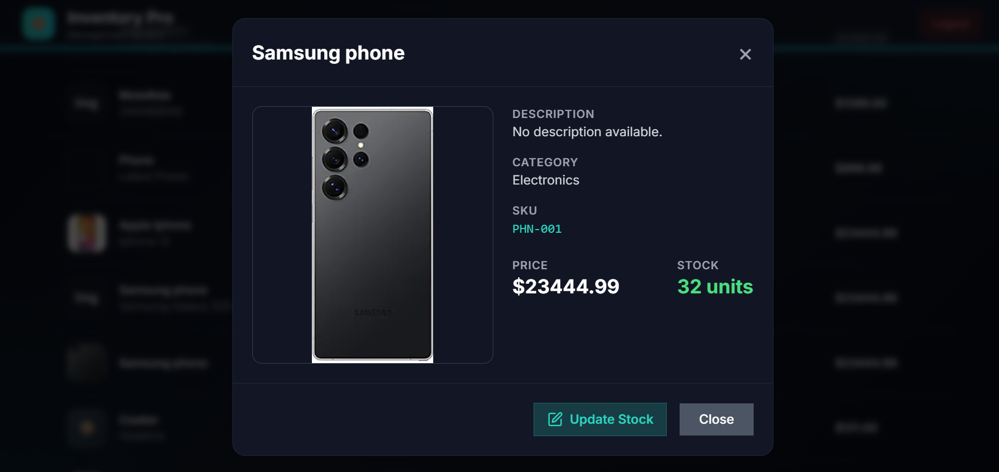
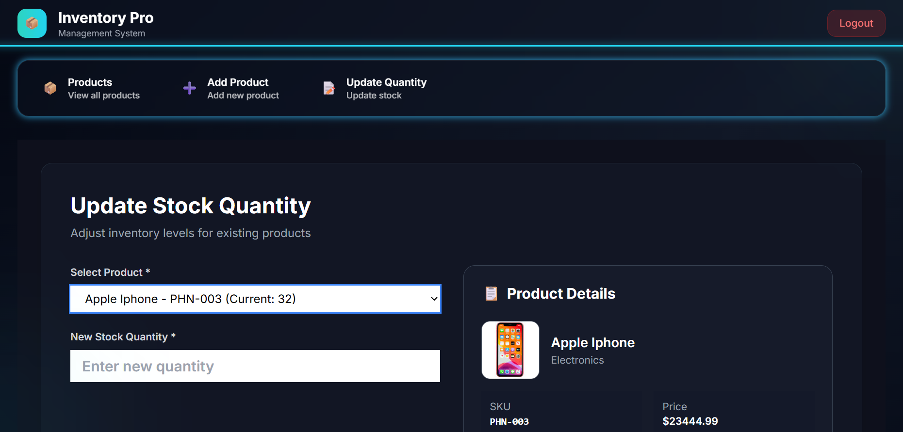
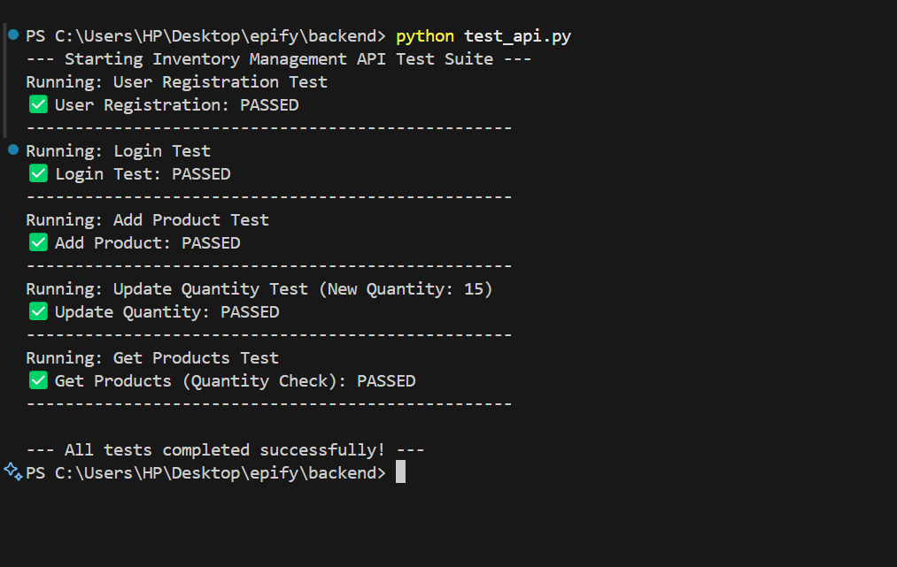

# Inventory Management System

This project is a full-stack inventory management application built with a Python/Flask backend, a MongoDB database, and a React frontend. It provides secure, token-based REST APIs for user authentication and product inventory management.

## Features

- **User Authentication**: Secure user registration and login using JSON Web Tokens (JWT).
- **Product Management**: Add, view, and update product information.
- **Unique SKU Enforcement**: Ensures every product has a unique Stock Keeping Unit (SKU).
- **Paginated API**: Efficiently retrieves product lists page by page.
- **Interactive Frontend**: A modern, responsive React UI to interact with the inventory.
- **Product Detail Modal**: Click on any product to view its full details and update stock in a pop-up modal.

## Technology Stack

- **Backend**: Python, Flask, PyJWT, Flask-Cors
- **Database**: MongoDB
- **Frontend**: React, Vite, Tailwind CSS, Axios, react-hot-toast,Shadcn/ui.

---

## Database Schema

The application uses a MongoDB database named `inventory_db` with two main collections:

### 1. `users` Collection
Stores user credentials.
- `_id`: ObjectId (Primary Key)
- `public_id`: String (Unique ID for API usage)
- `username`: String (Unique)
- `password`: String (Hashed)

### 2. `products` Collection
Stores product inventory information.
- `_id`: ObjectId (Primary Key)
- `name`: String
- `type`: String
- `sku`: String
- `description`: String
- `image_url`: String
- `quantity`: Integer
- `price`: Float
- `added_by`: String (public_id of the user who added it)

---

## Setup and Installation

### Prerequisites
- Python 3.7+
- Node.js and npm
- MongoDB 

### 1. Backend Setup

```bash
# Clone the repository
git clone <your-github-repo-link>
cd INVENTRY-MANAGEMENT-SYSTEM/backend

# Create and activate a virtual environment
python3 -m venv venv
source venv/bin/activate
# On Windows: venv\Scripts\activate

# Install dependencies
pip install -r requirements.txt

# IMPORTANT: Database Initialization
# Connect to MongoDB 
# > use inventory_db


# Run the backend server
python app.py
```
> The backend server will be running on `http://localhost:8080`.

### 2. Frontend Setup

```bash
# Open a new terminal and navigate to the frontend folder
cd ../frontend

# Install dependencies
npm install

# Run the frontend development server
npm run dev
```
> The frontend will be running on `http://localhost:3000` (or another available port).

---

## How to Test

You can test the application in two ways:

1.  **Manual Testing**: Open the frontend URL in your browser, register a new user, log in, and use the interface to add and manage products.
2.  **Automated API Testing**: Use the provided Python script to test the backend endpoints directly.
    ```bash
    # In the backend folder (with venv activated)
    python test_api.py
    ````
## 🔐 Login Page


## 📋 Dashboard View


## 👁️ Product View Modal


## ♻️ Update Stock Modal


## 🔄 Route Check Example


---

